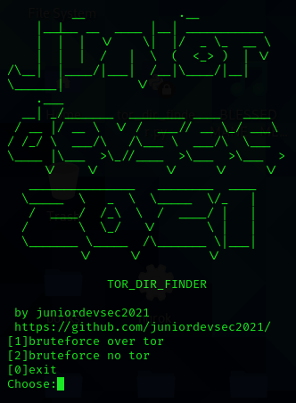
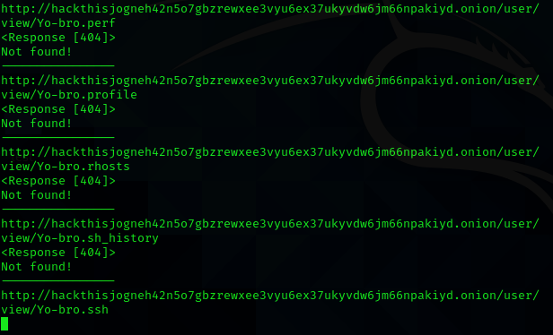

# dir_finder

## Directory bruteforce tool which can work over tor or clearnet.
* It can bruteforce .onion and clearnet domains.
* SETUP:
* OS: linux/ubuntu distros
* tor service /sudo apt install tor
* python modules: requests,cython./pip install requests cython
* run from terminal python3 tor_dir_finder.py
### The tool is POC.Only for educational purposes.
Use it on your own site.

